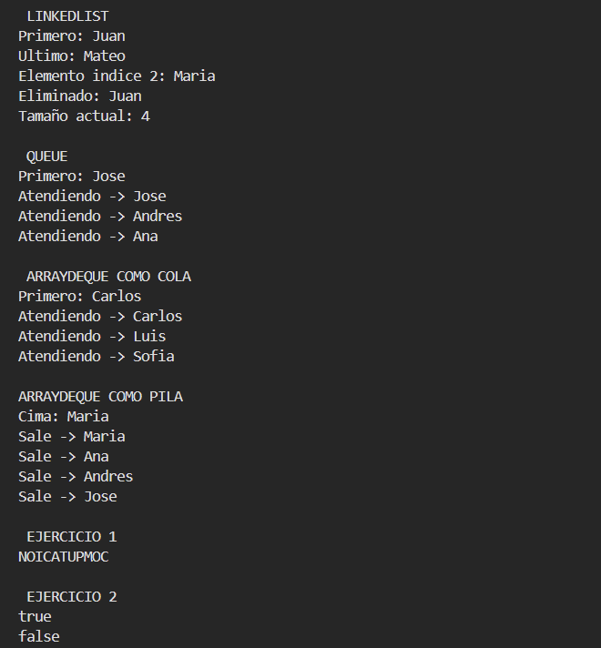

# Práctica: Estructuras Dinámicas Lineales

## Datos del Estudiante
- **Nombre:** [Xavier Aucay]
- **Curso:** [Grupo 3]
- **Fecha:** [9/6/2026]

---

## 1. Implementación de estructuras dinámicas lineales

**Fecha:** [9/6/2026]

**Descripción:**

En esta practica se implemento ejemplos de estructuras dinamicas lineales. Se trabajo con LinkedList, Queue y ArrayDeque, aplicando operaciones de insercion, consulta, recorrido y eliminación de elementos.




### Captura del código de implementación del ejercicio 1


## 2. Ejercicio Palíndromo

**Fecha:** [9/6/2026]

**Descripción:**
Se implemento un metodo llamado esPalindromo(String texto) utilizando solo una pila. El metodo genera el texto invertido y luego compara el resultado con la cadena original para determinar si es palindroma.
### Método implementado
````java
public boolean esPalindromo(String texto) {
        ArrayDeque<Character> pila = new ArrayDeque<>();
        for (char letra : texto.toCharArray()) {
            pila.push(letra);
        }

        String invertido = "";

        while (!pila.isEmpty()) {
            invertido += pila.pop();
        }

        return texto.equals(invertido);
    }

